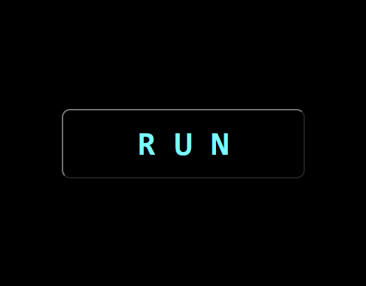

# IronHack Project | Canvas Game

# R U N

## Description

R U N is a game where the player has to move a ball from left to right in order to stop it from reaching the top of the screen, once this happens the game will end. The longer the player manages to keep the ball away from the ceiling, the higher the score will be.

## Backlog

- Increase difficulty as the game progresses.

## Data Structure

#### assets.js

- class Ball
- class Tile
- class Gap

#### audio.js

#### tileGenerator.js

#### moveBall.js

#### detectCollision.js

#### gameOver.js

#### main.js

- startGame() {}
- gameInterval = setInterval() {}

## Links

#### Repository and Deployment

[Repository](https://github.com/SantAndresP/ironhack-canvas-game-project)
[Deployment](https://santandresp.github.io/ironhack-canvas-game-project/)

#### Presentation

[Slides](https://docs.google.com/presentation/d/1gabh3tL0dj5uhVbyFVrbhirQNom2Dldzw63KYOpNraM/edit?usp=sharing)
